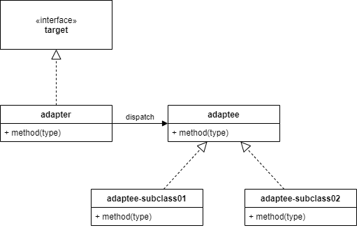

# 어댑터 패턴

## 기본정의
* 한 클래스의 인터페이스를 클라이언트에서 사용하고자 하는 다른 인터페이스로 변환시키는 디자인 패턴을 의미한다.
* 어댑터를 이용한다면 인터페이스 호환성 문제를 해결할 수 있다.

## 다이어그램

* target 인터페이스는 adaptee 인터페이스로 변환되어야 한다.
* target 인터페이스와 adaptee 인터페이스 간의 접점은 `adpater` 클래스가 중간에 존재하기 때문에 가능하다.
* adapter 는 adaptee 를 `composition` 하고 있다.
    * target 메소드를 오버라이딩한 adapter 는 adaptee 의 서브클래스 메소드를 실행할 수 있다.