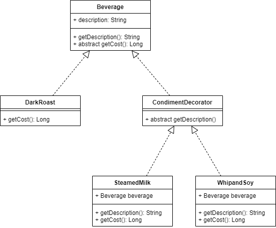

# 데코레이터 패턴

## bad step01
`Beverage` 추상 클래스를 상속받는 세 개의 클래스가 존재
* DarkRoast
* DarkRoastWithSteamedMilk
* DarkRoastWithWhipandSoy

`Beverage` 가 추가될때마다 계속해서 클래스를 늘려나가는 방법은 좋은 방법이 아님

## bad step02
`Beverage` 추상 클래스에서 음료를 만들기 위한 옵션들을 제공
* SteamedMilk 추가 여부
* WhipandSoy 추가 여부

아래의 문제점을 고려할 수 있다.
* 만약 음료를 만드는 옵션에 대한 가격이 변경된다면 ? : 기존 코드를 수정해야한다.
* 옵션들이 더 늘어나게 된다면 ? : `Beverage` 클래스 내 `getCost()` 메소드의 구현이 길어진다.
* 만약 일반 `Beverage` 클래스 내 `녹차` 가 들어간다면 ? : `녹차` 는 `WhipandSoy` 관련 메소드가 필요없는데 불필요한 상속을 야기시킨다.
* 만약 손님이 `DarkRoast` 에 대해서 `휘핑 2번` 을 원한다면 ? 

## composition 을 통한 `행위` 확장 : OCP
OCP 란 SOLID 원칙의 두번째 단계이다. `확장에는 열려있고 변경에는 닫혀있어야 함` 을 의미한다.
* 위의 bad case 를 살펴보고, 음료를 만들기 위해서 `데코레이터` 를 수행한다.
* `데코레이터` 객체를 `래퍼(wrapper)` 객체라고 생각하고 접근을 한다.

## 데코레이터 패턴
* 데코레이터 패턴은 객체에 추가적인 요건을 동적으로 첨가한다.
* 데코레이터에서는 서브클래스를 만드는 것을 통해서 유연하게 확장할 수 있는 방법을 제공한다.
* 데코레이터의 최상위 클래스와 데코레이터가 감싸고 있는 객체의 슈퍼클래스는 `동일` 하다.
* 데코레이터는 자신이 장식하고 있는 객체에 어떤 행동을 위임하는 것 이외에도 `추가적인` 행동을 수행할 수 있다.
    * `추가적인` 행동은 새롭게 데코레이터 객체에서 구현하는 것이 아닌 `composition` 으로 들어온 객체를 이용해서 새롭게 행동을 구성하는 것이다.
        * `StreamMilk.getDescription()` 메소드처럼.
* 단순 상속만 이용한 것이 아닌 `composition` 을 이용했기 때문에 동적으로 새로운 행동이 추가될 수 있었다.

## good 

* `DarkRoast` 와 `StreamMilk`, `WhipandSoy` 는 최상위 클래스가 동일하다.
* `DarkRoast` 는 `StreamMilk`, `WhipandSoy` 에 의해서 계속해서 `데코레이터` 될 수 있다.
* `데코레이터` 를 통해서 상속으로 객체의 `형식` 을 맞춘다.
* `Beverage` 를 추상클래스로 한 이유
    * 문제해결을 위해서 코드를 처음 받을 시 추상클래스로 구현되어 있었기 때문. (인터페이스를 사용해도 무방) ,
    
    
## reference
* 헤드퍼스트 디자인 패턴
